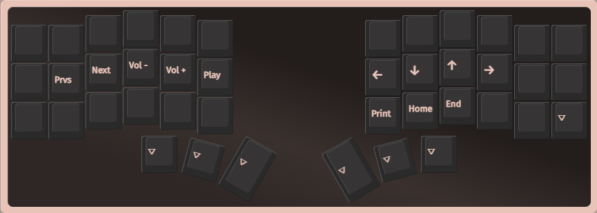
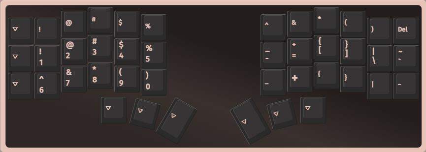
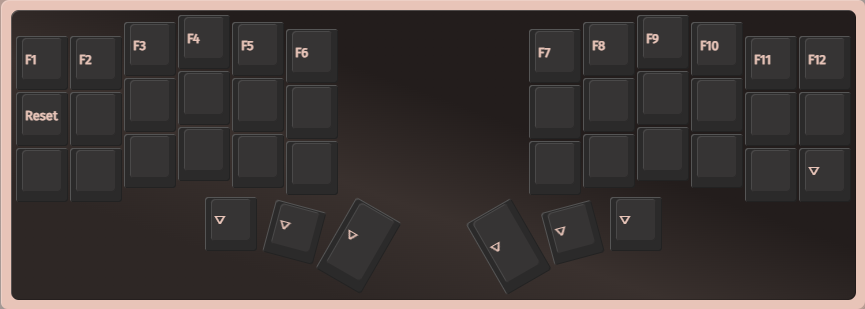

# Corne Keyboard

My corne keyboard layout ⌨️

## How To Use

Open [usevia.app](https://usevia.app), click on the `SAVE + LOAD` menu and load the configuration you have downloaded.

## Preview

### Layer 0

QWERTY

Colemak DH

### Layer 1

### Layer 2

### Layer 3

